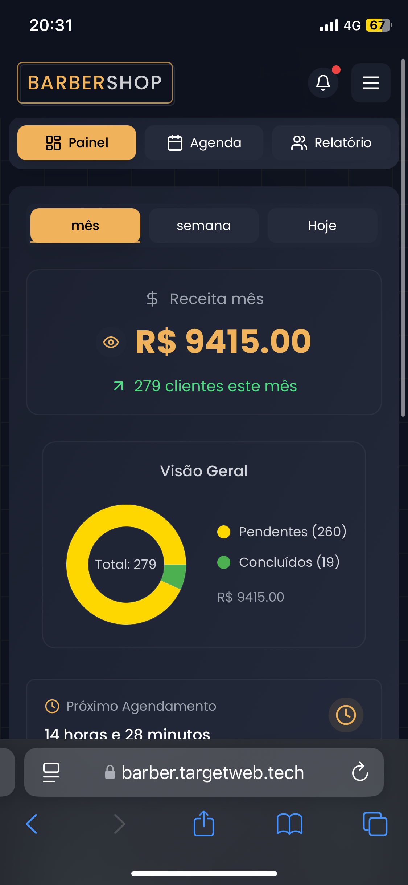
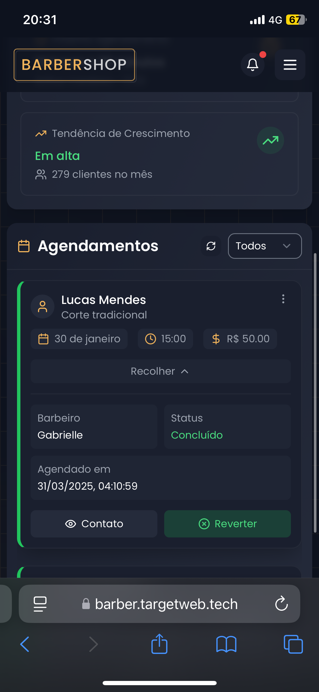
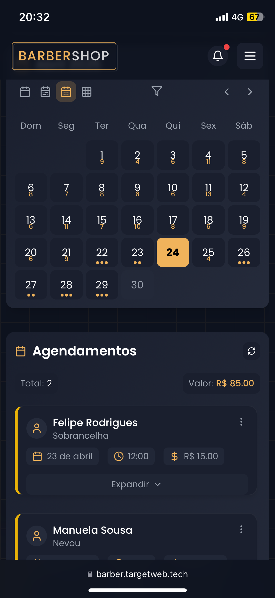
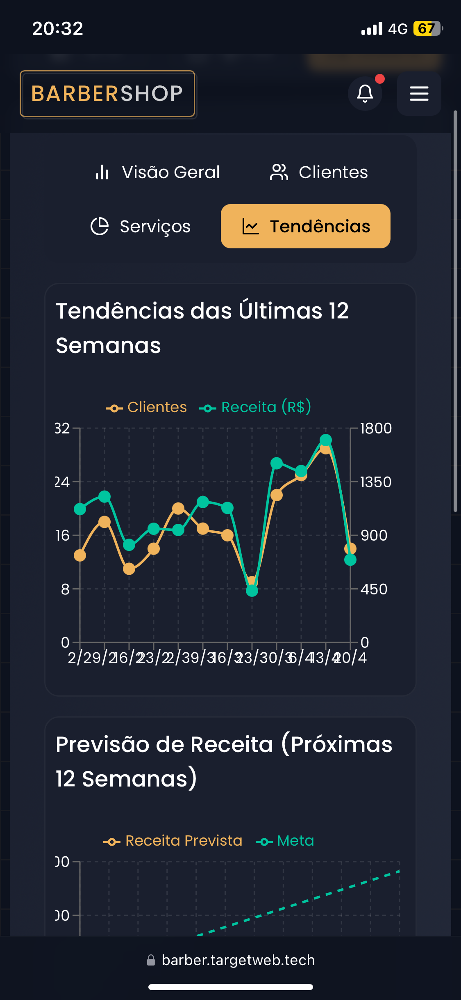

# BarberGR

BarberGR é um sistema de agendamento para barbearias, permitindo que clientes escolham um barbeiro, selecione um serviço e agendem um horário de forma simples e rápida.

## Tecnologias Utilizadas

- React.js
- TypeScript
- Tailwind CSS
- Lucide Icons

## Instalação

Para rodar o projeto localmente, siga os seguintes passos:

1. Clone o repositório:
   ```sh
   git clone https://github.com/maiconbre/BarberGR.git
   ```
2. Acesse o diretório do projeto:
   ```sh
   cd BarberGR
   ```
3. Instale as dependências:
   ```sh
   npm install
   ```
4. Inicie o servidor de desenvolvimento:
   ```sh
   npm run dev
   ```

No final da pagina no rodape tem um
botao de "area do barbeiro" leva pra login 
credenciais teste: admin/123123; gabrielle/123123, marcos/123123

O projeto ja entá disponível e responsivo para mobiles no Vercel somente clicando aqui: [BarberGR no Vercel](https://barber.targetweb.tech/).


## 📸 Capturas de Tela

### Tela Inicial                                      Horarios disponiveis                   Dashboard                               
                                          

 

   


### Cards de agendamento                 Agenda do barbeiro                 Métricas
                                        


### (Projeto ainda em desenvolvimento para melhor experiencia desktops)


## Licença

Este projeto está licenciado sob a MIT License .

