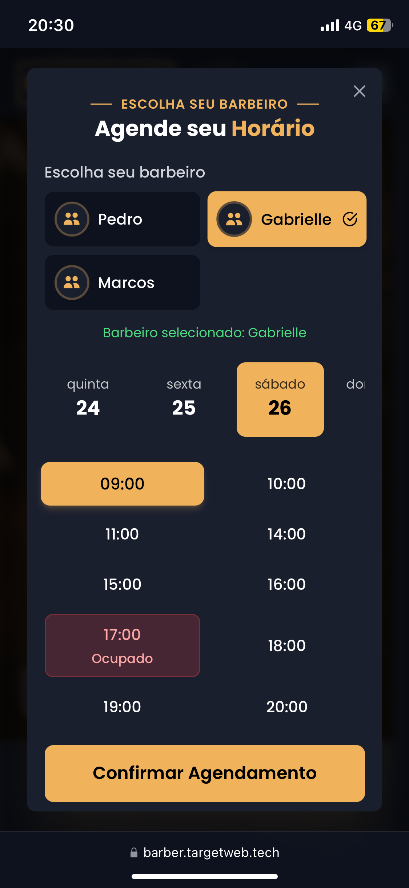
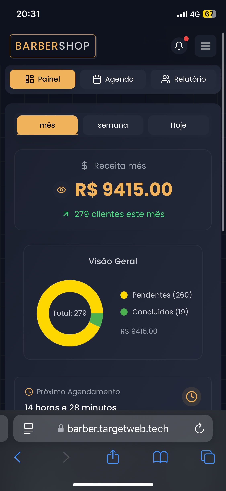
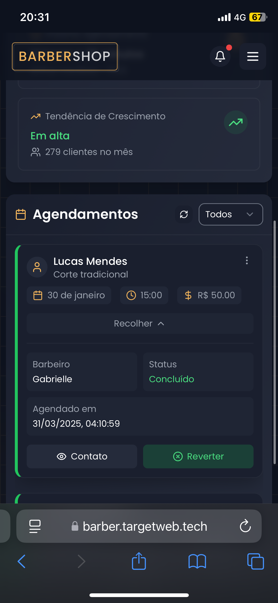
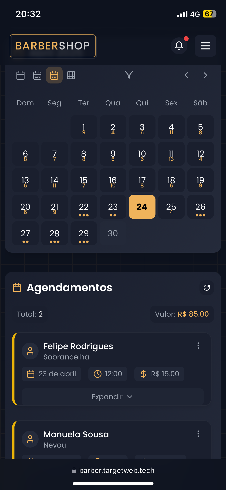
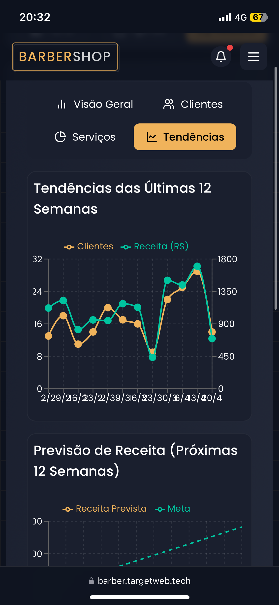

# BarberGR - Sistema de Agendamento para Barbearias

<p align="center">
  
</p>

O BarberGR é um sistema completo de agendamento para barbearias, desenvolvido com tecnologias modernas e seguindo princípios de arquitetura limpa. A aplicação permite que clientes escolham um barbeiro, selecionem um serviço e agendem um horário de forma simples e rápida, além de oferecer um painel administrativo completo para gerenciamento de agendamentos, serviços e barbeiros.

## 🚀 Funcionalidades

### Para Clientes
- Visualização de serviços disponíveis
- Seleção de barbeiros
- Agendamento de horários
- Histórico de agendamentos
- Avaliação de serviços
- Gerenciamento de perfil

### Para Barbeiros
- Visualização de agenda
- Gerenciamento de horários disponíveis
- Confirmação de agendamentos
- Histórico de atendimentos
- Métricas de desempenho

### Para Administradores
- Gerenciamento de barbeiros
- Configuração de serviços
- Análise de métricas e relatórios
- Moderação de comentários
- Configuração de horários de funcionamento

## 🛠️ Tecnologias Utilizadas

### Frontend
- **React.js** - Biblioteca para construção de interfaces
- **TypeScript** - Superset tipado de JavaScript
- **Tailwind CSS** - Framework CSS utilitário
- **Framer Motion** - Biblioteca para animações
- **Zustand** - Gerenciamento de estado global
- **React Router** - Roteamento da aplicação
- **Zod** - Validação de dados
- **Recharts** - Biblioteca para visualização de dados
- **React Window** - Virtualização para listas de alta performance

### Ferramentas de Build
- **Vite** - Ferramenta de build rápida
- **ESLint** - Linter para JavaScript/TypeScript
- **PostCSS** - Processador CSS

## 🏗️ Arquitetura

O BarberGR segue uma arquitetura modular baseada em princípios SOLID, com separação clara de responsabilidades:

### Estrutura de Diretórios

```
src/
├── components/     # Componentes React reutilizáveis
├── constants/      # Constantes e configurações
├── contexts/       # Contextos React (AuthContext)
├── hooks/          # Hooks personalizados
├── models/         # Modelos de domínio
├── pages/          # Componentes de página
├── services/       # Serviços (API, Cache)
├── stores/         # Gerenciamento de estado (Zustand)
├── types/          # Definições de tipos TypeScript
├── utils/          # Funções utilitárias
└── validation/     # Esquemas de validação (Zod)
```

### Padrões Implementados

#### Sistema de Cache
O BarberGR implementa um sistema de cache sofisticado para melhorar o desempenho e reduzir chamadas desnecessárias à API:

- **CacheService**: Implementação seguindo princípios SOLID com estratégias de armazenamento intercambiáveis
- **useCache**: Hook personalizado para gerenciar dados em cache com suporte a invalidação e atualização
- **Estratégias de Armazenamento**: Suporte para cache em memória e localStorage

#### Autenticação
Sistema de autenticação baseado em tokens com suporte para diferentes níveis de acesso:

- **AuthContext**: Contexto React para gerenciar estado de autenticação
- **Proteção de Rotas**: Componente ProtectedRoute para controle de acesso
- **Persistência de Sessão**: Suporte para "lembrar-me" e renovação automática de tokens

#### Gerenciamento de Estado
Utilização do Zustand para gerenciamento de estado global com stores específicas para diferentes domínios:

- **appointmentStore**: Gerenciamento de agendamentos
- **authStore**: Estado de autenticação

## 📊 Recursos Avançados

### Sistema de Notificações
Implementação de um sistema de notificações em tempo real para alertar sobre novos agendamentos e comentários pendentes.

### Virtualização de Listas
Utilização de técnicas de virtualização para renderizar listas longas de forma eficiente, melhorando o desempenho em dispositivos com recursos limitados.

### Análise de Dados
Painéis analíticos com gráficos e métricas para acompanhamento de desempenho, tendências de agendamento e satisfação de clientes.

## 🚀 Instalação e Uso

### Pré-requisitos
- Node.js (v16 ou superior)
- npm ou yarn

### Passos para Instalação

1. Clone o repositório:
   ```sh
   git clone https://github.com/maiconbre/BarberGR.git
   ```

2. Acesse o diretório do projeto:
   ```sh
   cd BarberGR
   ```

3. Instale as dependências:
   ```sh
   npm install
   # ou
   yarn install
   ```

4. Inicie o servidor de desenvolvimento:
   ```sh
   npm run dev
   # ou
   yarn dev
   ```

5. Acesse a aplicação em [http://localhost:5173](http://localhost:5173)

### Credenciais de Teste
- **Admin**: admin/123123
- **Barbeiro**: gabrielle/123123, marcos/123123

## 📱 Demonstração

O projeto está disponível online e é totalmente responsivo para dispositivos móveis:

[BarberGR no Vercel](https://barber.targetweb.tech/)

## 📸 Capturas de Tela

<div align="center">
  <div>
    <h3>Tela Inicial | Horários Disponíveis | Dashboard</h3>
    
    
    
  </div>

  <div>
    <h3>Cards de Agendamento | Agenda do Barbeiro | Métricas</h3>
    
    
    
  </div>
</div>

## 🔄 Roadmap

- [ ] Implementação de PWA (Progressive Web App)
- [ ] Integração com sistemas de pagamento
- [ ] Notificações por email e SMS
- [ ] Aplicativo móvel nativo
- [ ] Suporte para múltiplas unidades/filiais

## 🤝 Contribuição

Contribuições são bem-vindas! Sinta-se à vontade para abrir issues e pull requests.

1. Faça um fork do projeto
2. Crie sua branch de feature (`git checkout -b feature/nova-funcionalidade`)
3. Commit suas mudanças (`git commit -m 'Adiciona nova funcionalidade'`)
4. Push para a branch (`git push origin feature/nova-funcionalidade`)
5. Abra um Pull Request

## 📄 Licença

Este projeto está licenciado sob a MIT License.

---

Desenvolvido com ❤️ por [Maicon Brendon](https://github.com/maiconbre)

