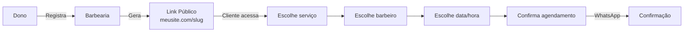
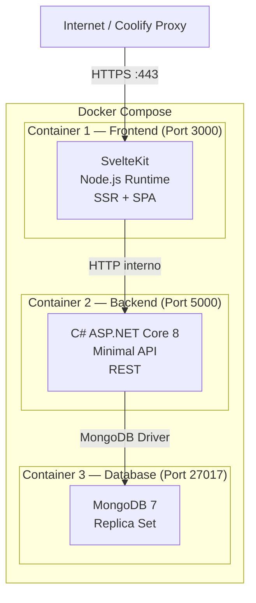
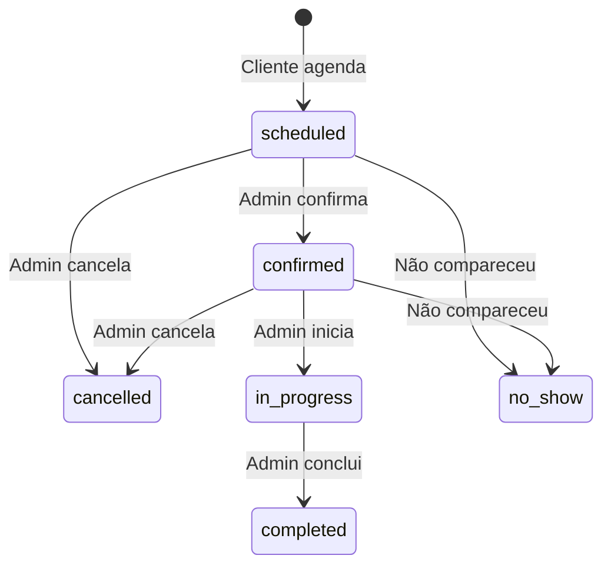
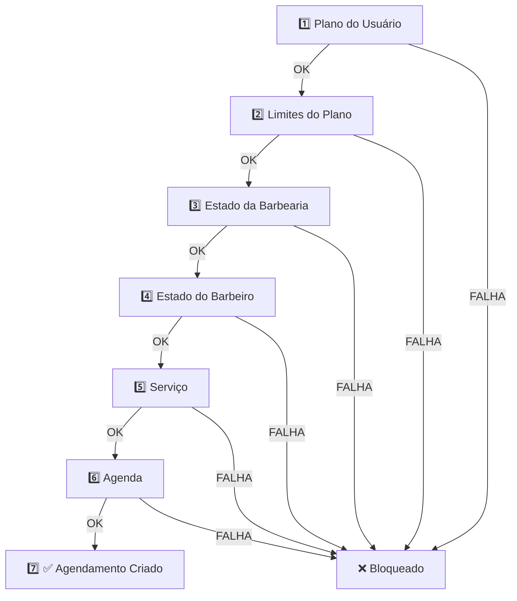
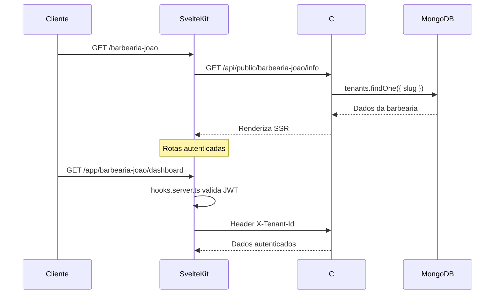
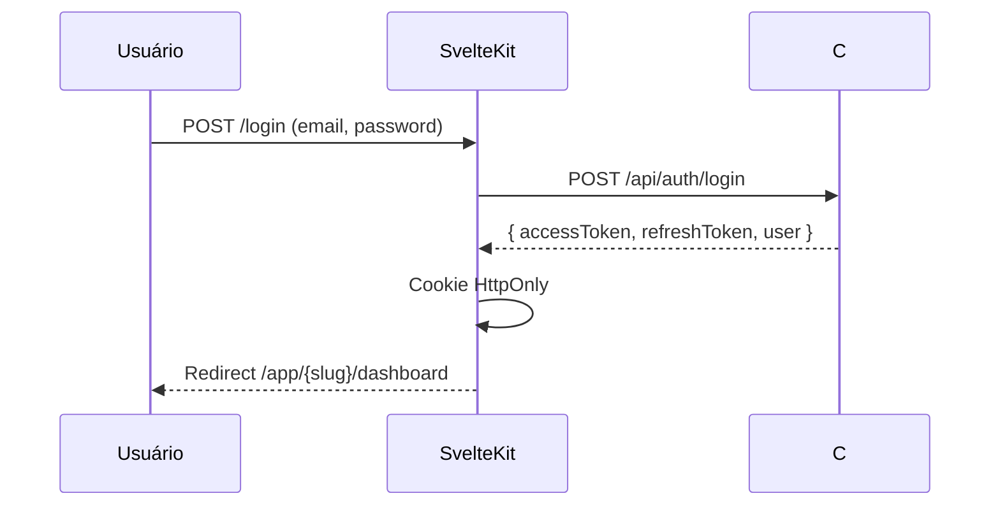
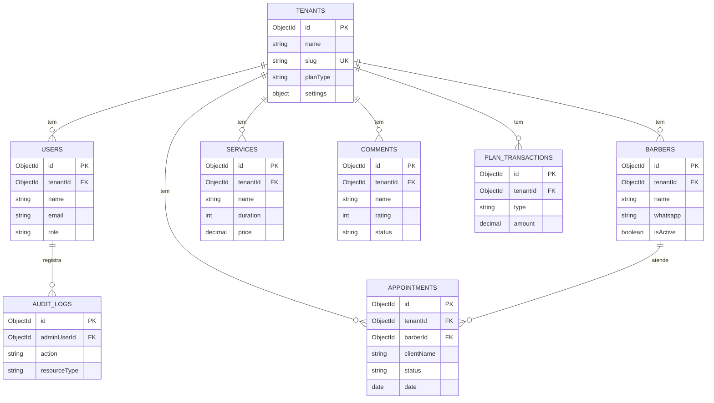
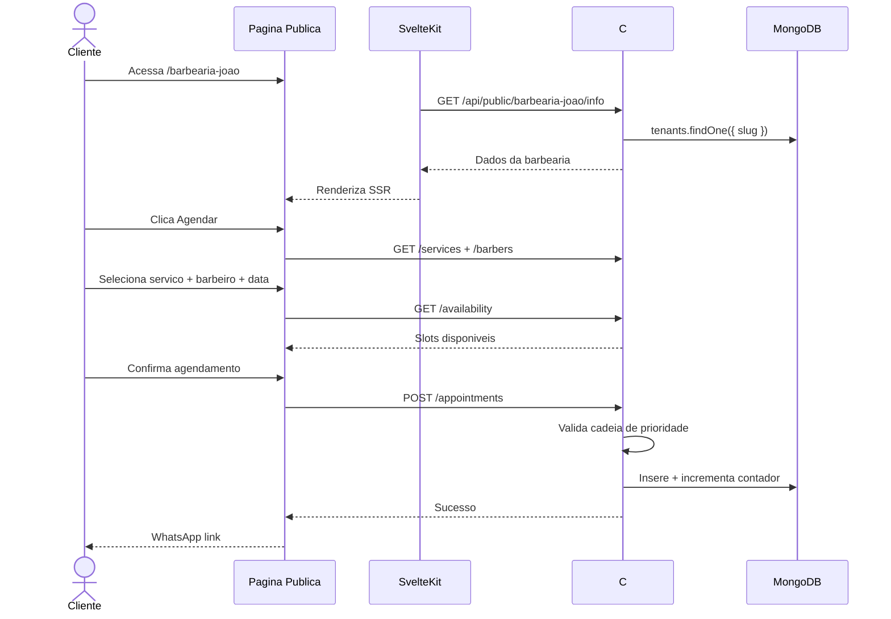

# 📋 BarberShop SaaS — Especificação Técnica Completa

> **Stack**: SvelteKit + C# ASP.NET Core 8 + MongoDB 7 + Docker Compose
> **Deploy**: Coolify (self-hosted PaaS)
> **Modelo**: Multi-tenant SaaS com links customizados

---

## 📑 Índice

1. [Visão Geral do Negócio](#1-visão-geral-do-negócio)
2. [Arquitetura do Sistema](#2-arquitetura-do-sistema)
3. [Planos e Limites](#3-planos-e-limites)
4. [Módulos e Funcionalidades](#4-módulos-e-funcionalidades)
5. [Regras de Negócio](#5-regras-de-negócio)
6. [Modelos de Dados (MongoDB)](#6-modelos-de-dados-mongodb)
7. [API Endpoints (C# Backend)](#7-api-endpoints-c-backend)
8. [Rotas Frontend (SvelteKit)](#8-rotas-frontend-sveltekit)
9. [Multi-Tenancy](#9-multi-tenancy)
10. [Autenticação e Autorização](#10-autenticação-e-autorização)
11. [Design Spec / UI](#11-design-spec--ui)
12. [Docker Compose](#12-docker-compose)
13. [Deploy no Coolify](#13-deploy-no-coolify)
14. [Diagramas](#14-diagramas)

---

## 1. Visão Geral do Negócio

### O que é
Plataforma SaaS de **agendamento para barbearias** que permite donos de barbearias gerenciarem seus negócios e clientes agendarem online.

### Perfis de Usuário

| Perfil | Descrição | Acesso |
|--------|-----------|--------|
| **Super Admin** | Administrador da plataforma | Painel admin global |
| **Dono/Admin** | Dono da barbearia | Dashboard completo do tenant |
| **Manager** | Gerente da barbearia | Dashboard com restrições |
| **Employee** | Barbeiro/profissional | Agenda própria |
| **Cliente** | Cliente final | Sem login, apenas agendamento público |

### Fluxo Principal



---

## 2. Arquitetura do Sistema

### Diagrama de Containers



### Tecnologias Detalhadas

**Frontend (Container 1)**
- SvelteKit (latest) com adaptador Node
- Laisy UI (componentes)
- TypeScript
- SSR para SEO nas páginas públicas
- SPA para dashboard autenticado

**Backend (Container 2)**
- C# .NET 8 (Minimal API)
- MongoDB.Driver (oficial)
- JWT Authentication
- FluentValidation (validações)
- Swagger/OpenAPI

**Database (Container 3)**
- MongoDB 7 Community
- Replica Set (necessário para change streams)
- Indexes compostos para multi-tenancy

---

## 3. Planos e Limites

### Tabela de Planos

| Recurso | Free (R$0) | Start (R$19,90/mês) | Pro (R$49,90/mês) |
|---------|-----------|---------------------|-------------------|
| Barbeiros | 1 | 1 | 6 |
| Agendamentos/mês | 15 | 60 | 1.000 |
| Serviços | Ilimitados | Ilimitados | Ilimitados |
| Armazenamento | 100MB | 500MB | 1GB |
| Suporte | Email | Email/Chat | Prioritário |
| Relatórios | ❌ | ✅ | ✅ |

### Regras dos Planos

- Contador mensal **reinicia automaticamente** no dia 1 de cada mês
- Ao atingir limite de agendamentos: **bloqueia novos agendamentos** + mostra CTA de upgrade
- Ao atingir limite de barbeiros: **bloqueia criação** de novos barbeiros
- Agendamentos cancelados **NÃO retornam ao saldo**
- Upgrade é imediato; downgrade aplica no próximo ciclo

---

## 4. Módulos e Funcionalidades

### Módulo 1 — Conta & Plano

| Funcionalidade | Descrição |
|---------------|-----------|
| Ver plano atual | Exibe tipo, limites e uso |
| Ver uso mensal | Agendamentos usados / barbeiros ativos |
| Histórico de uso | Gráfico mensal de agendamentos |
| Upgrade/Downgrade | Troca de plano com confirmação |
| Bloqueio automático | Funções bloqueadas conforme limites |

### Módulo 2 — Barbearia

| Funcionalidade | Descrição |
|---------------|-----------|
| Dados da barbearia | Nome, descrição, endereço, telefone |
| Identidade visual | Logo, cores primária/secundária, tema |
| Horários de funcionamento | Por dia da semana (start/end/closed) |
| Slug (link público) | Única e imutável após criação |
| Página pública | Gerada automaticamente no `/{slug}` |

**Horários padrão:**
- Segunda a Sexta: 08:00 - 18:00
- Sábado: 08:00 - 16:00
- Domingo: Fechado

**Temas disponíveis:** Padrão, Escuro, Azul, Verde

**Cores preset branding:**
- Clássico (#3B82F6), Elegante (#6366F1), Moderno (#8B5CF6)
- Natural (#10B981), Quente (#F59E0B), Vibrante (#EF4444)

### Módulo 3 — Serviços

| Funcionalidade | Descrição |
|---------------|-----------|
| CRUD de serviços | Criar, editar, excluir |
| Nome | Texto, min 2 caracteres |
| Descrição | Texto, min 10 caracteres |
| Preço | Valor em R$ (BRL) |
| Duração | Em minutos (min: 15, max: 480) |
| Status | Ativo / Inativo |
| Associação | Vincular barbeiros específicos |

### Módulo 4 — Barbeiros (Profissionais)

| Funcionalidade | Descrição |
|---------------|-----------|
| CRUD de barbeiros | Criar, editar, excluir |
| Dados pessoais | Nome, email, telefone, bio |
| Contato | WhatsApp, PIX |
| Especialidades | Lista de especialidades |
| Agenda individual | WorkingHours por dia da semana |
| Foto/Avatar | Upload de imagem (max 5MB, jpg/png/webp) |
| Status | Ativo / Inativo |
| Rating | Avaliação média (1-5 estrelas) |

### Módulo 5 — Agenda

| Funcionalidade | Descrição |
|---------------|-----------|
| Visão semanal | Grade de horários estilo Google Calendar |
| Visão mensal | Calendário com indicadores |
| Bloqueio de horário | Manual pelo barbeiro/admin |
| Slot duration | 30 minutos padrão |
| Break duration | 15 minutos entre atendimentos |
| Auto-scroll | Scroll automático para hora atual |
| Filtros | Por barbeiro, por status |

### Módulo 6 — Agendamentos (Core do Sistema)

| Funcionalidade | Descrição |
|---------------|-----------|
| Criar agendamento | Via página pública (cliente) |
| Listar agendamentos | Com filtros (status, barbeiro, data) |
| Detalhes | Visualização completa |
| Confirmar | Agendado → Confirmado |
| Iniciar | Confirmado → Em Andamento (±15min do horário) |
| Concluir | Em Andamento → Concluído |
| Cancelar | Agendado/Confirmado → Cancelado |
| Reagendar | Alterar data/hora (apenas upcoming) |
| No-show | Marcar como não compareceu |

**Ciclo de vida do agendamento:**



### Módulo 7 — Clientes

| Funcionalidade | Descrição |
|---------------|-----------|
| Cadastro automático | Ao agendar pela primeira vez |
| Dados mínimos | Nome + WhatsApp |
| Histórico | Agendamentos passados do cliente |
| Sem login | Cliente não precisa de conta |

### Módulo 8 — Comentários/Avaliações

| Funcionalidade | Descrição |
|---------------|-----------|
| Enviar avaliação | Nome + comentário + rating (1-5) |
| Moderação | pending → approved / rejected |
| Exibição pública | Apenas aprovados na página pública |
| CRUD admin | Aprovar, rejeitar, resetar, excluir |

### Módulo 9 — Admin Central (Super Admin)

| Funcionalidade | Descrição |
|---------------|-----------|
| Métricas globais | Total barbearias, agendamentos, receita, MRR |
| Listar barbearias | Com filtros (plano, status, busca) |
| Alterar plano | Forçar upgrade/downgrade |
| Suspender/Ativar | Mudar status da barbearia |
| Logs de auditoria | Registro de ações admin |

---

## 5. Regras de Negócio

### Regra de Prioridade — Cadeia de Validação

> **Se qualquer nível falhar, o fluxo para imediatamente.**



### Regras de Agendamento

| Regra | Descrição |
|-------|-----------|
| Contagem | Conta no limite **no momento da criação** |
| Cancelamento | NÃO devolve saldo |
| Conflito | Proibido agendar mesmo barbeiro, mesma data, mesmo horário |
| Data passada | Proibido agendar para datas passadas |
| Início antecipado | Pode iniciar até 15 min antes |
| Início atrasado | Pode iniciar até 30 min depois |
| Reagendar | Apenas status scheduled ou confirmed + futuro |

### Regras de Slug

| Regra | Descrição |
|-------|-----------|
| Formato | Apenas letras minúsculas, números e hífens |
| Min/Max | 3-50 caracteres |
| Única | Não pode repetir entre barbearias |
| Imutável | Não pode ser alterada após criação |
| Geração | Auto-gerada a partir do nome (normalizada) |

### Regras de Validação

| Campo | Regra |
|-------|-------|
| Senha | Mínimo 6 caracteres |
| Nome | Mínimo 2 caracteres |
| Descrição | Mínimo 10 caracteres |
| Comentário | Mínimo 10 caracteres |
| Duração serviço | 15-480 minutos |
| Rating | 1-5 (inteiro) |
| WhatsApp | 10-15 dígitos (apenas números) |
| Upload | Max 5MB, formatos: jpg, jpeg, png, webp |

---

## 6. Modelos de Dados (MongoDB)

### Collection: `tenants`

```json
{
  "_id": "ObjectId",
  "name": "string",
  "slug": "string (unique, immutable)",
  "ownerEmail": "string",
  "planType": "free | start | pro",
  "planStatus": "active | suspended | cancelled",
  "settings": {
    "theme": "default | dark | blue | green",
    "workingHours": {
      "monday": { "start": "08:00", "end": "18:00", "closed": false },
      "tuesday": { "start": "08:00", "end": "18:00", "closed": false },
      "wednesday": { "start": "08:00", "end": "18:00", "closed": false },
      "thursday": { "start": "08:00", "end": "18:00", "closed": false },
      "friday": { "start": "08:00", "end": "18:00", "closed": false },
      "saturday": { "start": "08:00", "end": "16:00", "closed": false },
      "sunday": { "start": null, "end": null, "closed": true }
    },
    "notifications": { "email": true, "whatsapp": false },
    "branding": {
      "primaryColor": "#3B82F6",
      "secondaryColor": "#1E40AF",
      "logoUrl": "string | null"
    },
    "contact": {
      "phone": "string | null",
      "address": "string | null",
      "website": "string | null"
    }
  },
  "description": "string | null",
  "address": "string | null",
  "phone": "string | null",
  "usageCounters": {
    "appointmentsThisMonth": 0,
    "lastResetDate": "ISODate"
  },
  "createdAt": "ISODate",
  "updatedAt": "ISODate"
}
```

**Indexes:** `{ slug: 1 }` (unique), `{ ownerEmail: 1 }`, `{ planType: 1 }`

---

### Collection: `users`

```json
{
  "_id": "ObjectId",
  "tenantId": "ObjectId (ref: tenants)",
  "name": "string",
  "email": "string (unique per tenant)",
  "passwordHash": "string",
  "phone": "string | null",
  "role": "admin | manager | employee | client",
  "isActive": true,
  "lastLogin": "ISODate | null",
  "createdAt": "ISODate",
  "updatedAt": "ISODate"
}
```

**Indexes:** `{ tenantId: 1, email: 1 }` (unique compound), `{ tenantId: 1, role: 1 }`

---

### Collection: `barbers`

```json
{
  "_id": "ObjectId",
  "tenantId": "ObjectId (ref: tenants)",
  "userId": "ObjectId (ref: users) | null",
  "name": "string",
  "email": "string",
  "phone": "string | null",
  "whatsapp": "string | null",
  "pix": "string | null",
  "bio": "string | null",
  "avatar": "string | null",
  "profileImage": "string | null",
  "specialties": ["string"],
  "isActive": true,
  "workingHours": {
    "monday": [{ "start": "08:00", "end": "12:00" }, { "start": "14:00", "end": "18:00" }],
    "tuesday": [{ "start": "08:00", "end": "18:00" }]
  },
  "rating": 0,
  "totalAppointments": 0,
  "experience": "string | null",
  "createdAt": "ISODate",
  "updatedAt": "ISODate"
}
```

**Indexes:** `{ tenantId: 1, isActive: 1 }`, `{ tenantId: 1, email: 1 }`

---

### Collection: `services`

```json
{
  "_id": "ObjectId",
  "tenantId": "ObjectId (ref: tenants)",
  "name": "string",
  "description": "string",
  "duration": "int (minutos, 15-480)",
  "price": "decimal (BRL)",
  "isActive": true,
  "barberIds": ["ObjectId (ref: barbers)"],
  "order": "int (ordem de exibição)",
  "createdAt": "ISODate",
  "updatedAt": "ISODate"
}
```

**Indexes:** `{ tenantId: 1, isActive: 1 }`, `{ tenantId: 1, order: 1 }`

---

### Collection: `appointments`

```json
{
  "_id": "ObjectId",
  "tenantId": "ObjectId (ref: tenants)",
  "barberId": "ObjectId (ref: barbers)",
  "serviceId": "ObjectId (ref: services) | null",
  "clientName": "string",
  "clientWhatsapp": "string",
  "serviceName": "string",
  "barberName": "string",
  "date": "ISODate (apenas data)",
  "startTime": "string (HH:mm)",
  "endTime": "string (HH:mm)",
  "price": "decimal (BRL)",
  "status": "scheduled | confirmed | in_progress | completed | cancelled | no_show",
  "notes": "string | null",
  "cancelReason": "string | null",
  "createdAt": "ISODate",
  "updatedAt": "ISODate"
}
```

**Indexes:**
- `{ tenantId: 1, date: 1, barberId: 1 }` — busca de agenda
- `{ tenantId: 1, status: 1 }` — filtragem por status
- `{ tenantId: 1, date: 1, startTime: 1, barberId: 1 }` — conflito
- `{ tenantId: 1, createdAt: -1 }` — listagem recente

---

### Collection: `comments`

```json
{
  "_id": "ObjectId",
  "tenantId": "ObjectId (ref: tenants)",
  "name": "string",
  "comment": "string (min 10 chars)",
  "rating": "int (1-5)",
  "status": "pending | approved | rejected",
  "createdAt": "ISODate",
  "updatedAt": "ISODate"
}
```

**Indexes:** `{ tenantId: 1, status: 1 }`, `{ tenantId: 1, createdAt: -1 }`

---

### Collection: `audit_logs`

```json
{
  "_id": "ObjectId",
  "adminUserId": "ObjectId (ref: users)",
  "action": "string",
  "resourceType": "barbershop | user | plan",
  "resourceId": "string",
  "changes": "object (before/after)",
  "createdAt": "ISODate"
}
```

### Collection: `plan_transactions`

```json
{
  "_id": "ObjectId",
  "tenantId": "ObjectId (ref: tenants)",
  "type": "plan_activation | plan_upgrade",
  "fromPlan": "string | null",
  "toPlan": "string",
  "amount": "decimal",
  "status": "completed | pending | failed",
  "paymentMethod": "string | null",
  "transactionId": "string | null",
  "description": "string",
  "createdAt": "ISODate"
}
```

---

## 7. API Endpoints (C# Backend)

### Auth

| Método | Endpoint | Descrição |
|--------|----------|-----------|
| POST | `/api/auth/register` | Registrar novo usuário |
| POST | `/api/auth/login` | Login (retorna JWT) |
| POST | `/api/auth/refresh` | Refresh token |
| POST | `/api/auth/logout` | Invalidar token |
| POST | `/api/auth/magic-link` | Enviar magic link por email |
| POST | `/api/auth/change-password` | Alterar senha |

### Tenant / Barbearia

| Método | Endpoint | Descrição |
|--------|----------|-----------|
| POST | `/api/barbershops` | Registrar nova barbearia |
| GET | `/api/barbershops/check-slug/{slug}` | Verificar disponibilidade de slug |
| GET | `/api/barbershops/current` | Dados da barbearia logada |
| PUT | `/api/barbershops/current` | Atualizar dados da barbearia |
| PUT | `/api/barbershops/current/settings` | Atualizar configurações |

### Barbeiros

| Método | Endpoint | Descrição |
|--------|----------|-----------|
| GET | `/api/barbers` | Listar barbeiros do tenant |
| GET | `/api/barbers/{id}` | Detalhes de um barbeiro |
| POST | `/api/barbers` | Criar barbeiro |
| PUT | `/api/barbers/{id}` | Atualizar barbeiro |
| DELETE | `/api/barbers/{id}` | Excluir barbeiro |
| PATCH | `/api/barbers/{id}/toggle-active` | Ativar/desativar |
| PATCH | `/api/barbers/{id}/contact` | Atualizar WhatsApp |
| PATCH | `/api/barbers/{id}/payment` | Atualizar PIX |

### Serviços

| Método | Endpoint | Descrição |
|--------|----------|-----------|
| GET | `/api/services` | Listar serviços do tenant |
| GET | `/api/services/{id}` | Detalhes de um serviço |
| POST | `/api/services` | Criar serviço |
| PUT | `/api/services/{id}` | Atualizar serviço |
| DELETE | `/api/services/{id}` | Excluir serviço |
| PATCH | `/api/services/{id}/toggle-active` | Ativar/desativar |

### Agendamentos (Autenticado)

| Método | Endpoint | Descrição |
|--------|----------|-----------|
| GET | `/api/appointments` | Listar (com filtros) |
| GET | `/api/appointments/{id}` | Detalhes |
| POST | `/api/appointments` | Criar agendamento |
| PATCH | `/api/appointments/{id}/status` | Atualizar status |
| PATCH | `/api/appointments/{id}/reschedule` | Reagendar |
| DELETE | `/api/appointments/{id}` | Cancelar/excluir |

**Query params:** `?barberId=&status=&dateFrom=&dateTo=&search=&page=&limit=`

### Agendamentos Públicos (sem auth)

| Método | Endpoint | Descrição |
|--------|----------|-----------|
| GET | `/api/public/{slug}/barbers` | Barbeiros ativos |
| GET | `/api/public/{slug}/services` | Serviços ativos |
| GET | `/api/public/{slug}/availability` | Horários disponíveis |
| POST | `/api/public/{slug}/appointments` | Criar agendamento público |
| GET | `/api/public/{slug}/info` | Dados públicos da barbearia |
| GET | `/api/public/{slug}/comments` | Comentários aprovados |
| POST | `/api/public/{slug}/comments` | Enviar avaliação |

### Comentários (Admin)

| Método | Endpoint | Descrição |
|--------|----------|-----------|
| GET | `/api/comments` | Listar todos (filtro status) |
| PATCH | `/api/comments/{id}/approve` | Aprovar |
| PATCH | `/api/comments/{id}/reject` | Rejeitar |
| PATCH | `/api/comments/{id}/reset` | Resetar para pendente |
| DELETE | `/api/comments/{id}` | Excluir |

### Plano & Uso

| Método | Endpoint | Descrição |
|--------|----------|-----------|
| GET | `/api/plan/current` | Plano e limites atuais |
| GET | `/api/plan/usage` | Estatísticas de uso |
| POST | `/api/plan/upgrade` | Fazer upgrade |
| GET | `/api/plan/history` | Histórico de transações |
| GET | `/api/plan/check-limit/{feature}` | Verificar limite |

### Admin Central

| Método | Endpoint | Descrição |
|--------|----------|-----------|
| POST | `/api/admin/login` | Login admin |
| GET | `/api/admin/metrics` | Métricas globais |
| GET | `/api/admin/barbershops` | Listar barbearias |
| PATCH | `/api/admin/barbershops/{id}/plan` | Alterar plano |
| PATCH | `/api/admin/barbershops/{id}/status` | Suspender/ativar |
| GET | `/api/admin/audit-logs` | Logs de auditoria |

### Health Check

| Método | Endpoint | Descrição |
|--------|----------|-----------|
| GET | `/api/health` | Status do servidor |
| GET | `/api/health/db` | Status do MongoDB |

---

## 8. Rotas Frontend (SvelteKit)

### Estrutura de Pastas

```
src/routes/
├── +layout.svelte              # Layout raiz
├── +page.svelte                # Landing page (/)
├── login/+page.svelte          # Login (/login)
├── register-barbershop/
│   └── +page.svelte            # Registro de barbearia
├── verify-email/+page.svelte   # Verificação de email
├── admin/
│   ├── login/+page.svelte      # Login admin
│   ├── dashboard/+page.svelte  # Dashboard admin
│   └── barbershops/+page.svelte# Lista barbearias
├── [slug]/
│   ├── +page.svelte            # Página pública (SSR!)
│   └── +page.server.ts         # Server load (resolver slug)
├── app/
│   └── [slug]/
│       ├── +layout.svelte      # Layout dashboard (sidebar)
│       ├── +layout.server.ts   # Auth guard + tenant resolver
│       ├── dashboard/+page.svelte
│       ├── agenda/+page.svelte
│       ├── analytics/+page.svelte
│       ├── servicos/+page.svelte
│       ├── equipe/+page.svelte
│       ├── gerenciar-comentarios/+page.svelte
│       ├── gerenciar-horarios/+page.svelte
│       ├── trocar-senha/+page.svelte
│       └── upgrade/+page.svelte
```

### Mapa de Rotas

| Rota | Tipo | Auth | Descrição |
|------|------|------|-----------|
| `/` | SSR | ❌ | Landing page |
| `/login` | SPA | ❌ | Login do dono |
| `/register-barbershop` | SPA | ❌ | Registro |
| `/verify-email` | SPA | ❌ | Verificação |
| `/admin/login` | SPA | ❌ | Login admin |
| `/admin/dashboard` | SPA | ✅ Admin | Dashboard admin |
| `/admin/barbershops` | SPA | ✅ Admin | Lista barbearias |
| `/{slug}` | **SSR** | ❌ | Página pública |
| `/app/{slug}/dashboard` | SPA | ✅ Owner/Manager | Dashboard |
| `/app/{slug}/agenda` | SPA | ✅ Owner/Manager/Employee | Calendário |
| `/app/{slug}/analytics` | SPA | ✅ Owner/Manager | Relatórios |
| `/app/{slug}/servicos` | SPA | ✅ Owner/Manager | Serviços |
| `/app/{slug}/equipe` | SPA | ✅ Owner/Manager | Barbeiros |
| `/app/{slug}/gerenciar-comentarios` | SPA | ✅ Owner/Manager | Moderação |
| `/app/{slug}/gerenciar-horarios` | SPA | ✅ Owner/Manager | Horários |
| `/app/{slug}/upgrade` | SPA | ✅ Owner | Upgrade |
| `/app/{slug}/trocar-senha` | SPA | ✅ Qualquer | Trocar senha |

---

## 9. Multi-Tenancy

### Modelo: Shared Database + Tenant Field

Cada documento (exceto `audit_logs`) possui campo `tenantId`. Todas as queries **DEVEM** filtrar por `tenantId`.

### Resolução de Tenant



### Headers da API

Toda requisição autenticada deve incluir:
```
Authorization: Bearer <jwt_token>
X-Tenant-Id: <tenant_id>
```

O backend C# deve ter um `TenantMiddleware` que:
1. Extrai `X-Tenant-Id` do header
2. Valida se o usuário pertence ao tenant
3. Injeta o `tenantId` no `HttpContext`

### Links Customizados

```
https://dominio.com/barbearia-joao          → Página pública (SSR)
https://dominio.com/app/barbearia-joao/     → Dashboard (autenticado)
```

---

## 10. Autenticação e Autorização

### JWT Flow



### Configuração JWT

| Parâmetro | Valor |
|-----------|-------|
| Algoritmo | HS256 |
| Access Token TTL | 1 dia |
| Refresh Token TTL | 7 dias |
| Storage (SvelteKit) | Cookie HttpOnly, Secure, SameSite=Lax |

### Permissões por Role

| Ação | admin | manager | employee |
|------|-------|---------|----------|
| Ver dashboard | ✅ | ✅ | ❌ |
| Gerenciar barbeiros | ✅ | ✅ | ❌ |
| Gerenciar serviços | ✅ | ✅ | ❌ |
| Gerenciar agenda | ✅ | ✅ | ✅ (própria) |
| Gerenciar comentários | ✅ | ✅ | ❌ |
| Ver analytics | ✅ | ✅ | ❌ |
| Upgrade plano | ✅ | ❌ | ❌ |
| Gerenciar membros | ✅ | ❌ | ❌ |

---

## 11. Design Spec / UI

### Paleta de Cores (Tema Dark)

| Token | Valor | Uso |
|-------|-------|-----|
| `--bg-primary` | `#0D121E` | Fundo principal |
| `--bg-secondary` | `#1A1F2E` | Cards, sidebar |
| `--bg-tertiary` | `#252B3B` | Inputs, hover |
| `--text-primary` | `#FFFFFF` | Texto principal |
| `--text-secondary` | `#94A3B8` | Texto secundário |
| `--accent` | `#3B82F6` | Botões, links |
| `--success` | `#10B981` | Status positivo |
| `--warning` | `#F59E0B` | Alertas |
| `--error` | `#EF4444` | Erros |

### Tipografia

- **Font**: Inter ou Outfit (Google Fonts)
- H1: 2rem/700, H2: 1.5rem/600, H3: 1.25rem/600
- Body: 1rem/400, Small: 0.875rem, Caption: 0.75rem

### Breakpoints

SM: 640px, MD: 768px, LG: 1024px, XL: 1280px, 2XL: 1536px

### Componentes UI Essenciais

- **Sidebar** — Dashboard lateral, colapsável
- **Calendar Grid** — Visão semanal (30min slots) estilo Google Calendar
- **Booking Modal** — Steps: serviço → barbeiro → data → hora → confirmação
- **Data Table** — Tabela com filtros, busca, paginação
- **Stats Cards** — Métricas com ícone, valor e variação
- **Toast** — Notificações no canto superior direito

### Animações

- Transição de página: `opacity 0→1, 150ms, ease-in-out`
- Hover em cards: `scale 1.02, 200ms`
- Modal: `fadeIn + slideUp, 200ms`

---

## 12. Docker Compose

### Estrutura de Pastas do Projeto

```
barbershop-saas/
├── docker-compose.yml
├── .env
├── .env.example
├── frontend/
│   ├── Dockerfile
│   ├── package.json
│   ├── svelte.config.js
│   └── src/
├── backend/
│   ├── Dockerfile
│   └── BarberShop.Api/
│       ├── BarberShop.Api.csproj
│       ├── Program.cs
│       ├── Controllers/
│       ├── Models/
│       ├── Services/
│       ├── Repositories/
│       ├── Middleware/
│       └── DTOs/
└── mongo/
    └── init-db.js
```

### docker-compose.yml

```yaml
version: "3.8"

services:
  frontend:
    build:
      context: ./frontend
      dockerfile: Dockerfile
    container_name: barbershop-frontend
    ports:
      - "3000:3000"
    environment:
      - NODE_ENV=production
      - API_URL=http://backend:5000
      - PUBLIC_APP_URL=${PUBLIC_APP_URL}
    depends_on:
      backend:
        condition: service_healthy
    restart: unless-stopped
    networks:
      - barbershop-network

  backend:
    build:
      context: ./backend
      dockerfile: Dockerfile
    container_name: barbershop-backend
    ports:
      - "5000:5000"
    environment:
      - ASPNETCORE_ENVIRONMENT=Production
      - ASPNETCORE_URLS=http://+:5000
      - "MongoDB__ConnectionString=mongodb://mongodb:27017/barbershop?replicaSet=rs0"
      - "MongoDB__DatabaseName=barbershop"
      - "Jwt__Secret=${JWT_SECRET}"
      - "Jwt__Issuer=${JWT_ISSUER}"
      - "Jwt__ExpiresInHours=24"
      - "Jwt__RefreshExpiresInDays=7"
    depends_on:
      mongodb:
        condition: service_healthy
    healthcheck:
      test: ["CMD", "curl", "-f", "http://localhost:5000/api/health"]
      interval: 30s
      timeout: 10s
      retries: 3
      start_period: 15s
    restart: unless-stopped
    networks:
      - barbershop-network

  mongodb:
    image: mongo:7
    container_name: barbershop-mongodb
    ports:
      - "27017:27017"
    volumes:
      - mongo_data:/data/db
      - ./mongo/init-db.js:/docker-entrypoint-initdb.d/init-db.js:ro
    environment:
      - MONGO_INITDB_DATABASE=barbershop
    command: ["--replSet", "rs0", "--bind_ip_all"]
    healthcheck:
      test: |
        mongosh --eval "try { rs.status() } catch (e) { rs.initiate({_id:'rs0', members:[{_id:0, host:'mongodb:27017'}]}) }"
      interval: 10s
      timeout: 5s
      retries: 5
      start_period: 10s
    restart: unless-stopped
    networks:
      - barbershop-network

volumes:
  mongo_data:
    driver: local

networks:
  barbershop-network:
    driver: bridge
```

### Dockerfile — Frontend

```dockerfile
FROM node:20-alpine AS builder
WORKDIR /app
COPY package*.json ./
RUN npm ci
COPY . .
RUN npm run build

FROM node:20-alpine
WORKDIR /app
COPY --from=builder /app/build ./build
COPY --from=builder /app/package*.json ./
COPY --from=builder /app/node_modules ./node_modules
ENV NODE_ENV=production
ENV PORT=3000
EXPOSE 3000
CMD ["node", "build"]
```

### Dockerfile — Backend

```dockerfile
FROM mcr.microsoft.com/dotnet/sdk:8.0 AS build
WORKDIR /src
COPY ["BarberShop.Api/BarberShop.Api.csproj", "BarberShop.Api/"]
RUN dotnet restore "BarberShop.Api/BarberShop.Api.csproj"
COPY . .
WORKDIR "/src/BarberShop.Api"
RUN dotnet publish -c Release -o /app/publish

FROM mcr.microsoft.com/dotnet/aspnet:8.0
WORKDIR /app
COPY --from=build /app/publish .
ENV ASPNETCORE_URLS=http://+:5000
EXPOSE 5000
ENTRYPOINT ["dotnet", "BarberShop.Api.dll"]
```

### .env.example

```env
PUBLIC_APP_URL=https://seudominio.com
JWT_SECRET=sua-chave-secreta-super-segura-minimo-32-caracteres
JWT_ISSUER=barbershop-api
```

### mongo/init-db.js

```javascript
db = db.getSiblingDB('barbershop');

// Collections
db.createCollection('tenants');
db.createCollection('users');
db.createCollection('barbers');
db.createCollection('services');
db.createCollection('appointments');
db.createCollection('comments');
db.createCollection('audit_logs');
db.createCollection('plan_transactions');

// Indexes
db.tenants.createIndex({ slug: 1 }, { unique: true });
db.tenants.createIndex({ ownerEmail: 1 });
db.users.createIndex({ tenantId: 1, email: 1 }, { unique: true });
db.users.createIndex({ tenantId: 1, role: 1 });
db.barbers.createIndex({ tenantId: 1, isActive: 1 });
db.services.createIndex({ tenantId: 1, isActive: 1 });
db.appointments.createIndex({ tenantId: 1, date: 1, barberId: 1 });
db.appointments.createIndex({ tenantId: 1, status: 1 });
db.appointments.createIndex({ tenantId: 1, date: 1, startTime: 1, barberId: 1 });
db.appointments.createIndex({ tenantId: 1, createdAt: -1 });
db.comments.createIndex({ tenantId: 1, status: 1 });
db.plan_transactions.createIndex({ tenantId: 1, createdAt: -1 });
db.audit_logs.createIndex({ createdAt: -1 });

print('Database initialized with collections and indexes');
```

---

## 13. Deploy no Coolify

### Configuração

1. **Tipo**: Docker Compose
2. **Repo**: Apontar para o repositório Git
3. **Compose file**: `docker-compose.yml`
4. **Domínio**: No serviço `frontend` (port 3000)
5. **SSL**: Automático (Let's Encrypt)

### Variáveis no Coolify

| Variável | Valor |
|----------|-------|
| `PUBLIC_APP_URL` | `https://seudominio.com` |
| `JWT_SECRET` | `openssl rand -base64 64` |
| `JWT_ISSUER` | `barbershop-api` |

### Checklist de Deploy

- [ ] Criar repo com estrutura frontend/ + backend/ + mongo/
- [ ] Configurar docker-compose.yml
- [ ] Adicionar variáveis de ambiente no Coolify
- [ ] Apontar domínio para IP do servidor
- [ ] Deploy via Coolify
- [ ] Verificar health checks
- [ ] Criar primeiro admin via script

---

## 14. Diagramas

### Diagrama ER Completo



### Fluxo de Agendamento Público



---

> [!TIP]
> **Para iniciar:** `docker compose up -d`
> Frontend: `http://localhost:3000` | Backend: `http://localhost:5000/swagger`
